# Astro-Dev
A Script to easily setup and build Astronomical Software including INDI, 3rd Party Drivers, INDI Web Manager, StellarSolver, GSC, and KStars for Mac and Linux (And possibly Windows) using the latest sources.  This will get you the latest bleeding edge versions and will facilitate development.

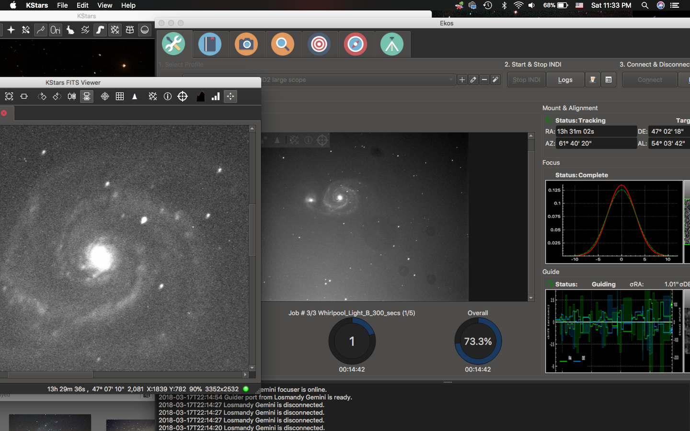

# About the repository
This repository is intended to make it easier to get set up to easily build the latest versions of INDI, INDI Web Manager App, 3rd Party Drivers, StellarSolver, GSC, and KStars 
as well as to be able to edit the source code to test out ideas, to diagnose problems, and to make contributions to the development of any or all of these programs. 
Recently, I have expanded the script so that it can build in Ubuntu Linux and may expand to other distros and to Windows in the future.  This script can build using the system, craft, or homebrew as a foundation. 
It can build with different architectures in parallel for testing purposes.  It can build using the original repositories or forked repositories.  It can optionally build with XCode on MacOS.  

# The History
This script evolved out of my previous repository [KStars-on-OSX-Craft](https://github.com/rlancaste/kstars-on-osx-craft).
Originally, this script depended on the other repository, but it now fully replaces its functionality and goes beyond that.  
In the past, this repo used command line options for some settings and options in text files for others.  Now, the options are mostly streamlined into several files which are explained below.

# Getting Everything Set Up at Once
While it is no longer necessary to run setup.sh or the other repository before using the other scripts in this repo, it might still be nice to get all set up at once with a development environment for working on astronomical software.
If you would like to just set up whichever programs you need, see the next section below, otherwise please follow these instructions.
1. Open your favorite Terminal program and type the following commands, if it asks you to install Developer Tools (on MacOS), click ok.
```
mkdir ~/Projects
cd  ~/Projects
git clone https://github.com/rlancaste/Astro-Dev.git
```
2. Edit the script [settings.sh](scripts/settings.sh) to make sure all the variables are correct for your system.
3. Enable the options you want for building in that script as well.
4. If you desire to use your own forks for development rather than the original repo for any of the astro packages, please see the section below that discusses the USE_FORKED_REPO option.
5. Drag [setup.sh](scripts/setup.sh) to your favorite Terminal or just copy and paste the following into Terminal and run the script.
```
~/Projects/Astro-Dev/scripts/setup.sh
```
6. Now either use the programs, or get set up to edit the software.  See the sections below for more details on this.

# Running the Individual Build Scripts
It used to be required that you run setup.sh before doing anything else.  This is no longer required.  You can run any of the scripts in the [build](scripts/build) folder. 
These build scripts all use the same common functions, so any of them can do any of the setup required to establish the folder structure and options for building. 
Just drag the desired script to the Terminal and it will get started.
Example:
```
~/Projects/Astro-Dev/scripts/build/INDICore.sh.sh
```
Alternatively, the [build-selectedPackages.sh](scripts/build/build-selectedPackages.sh) or [setup.sh](scripts/setup.sh) script will set up and build a whole list of packages.

# Running the Craft Setup and Build Scripts
In the [craft](scripts/craft) folder, there are several scripts which are helpful for setting up, testing, and using Craft to build software.
1. [setupCraft.sh](scripts/craft/setupCraft.sh). This script allows you to setup craft. It then builds key programs in craft to get needed packages and dependencies installed for development.
2. [setup-craftBlueprints.sh](scripts/craft/setup-craftBlueprints.sh). This script downloads and sets up the craft blueprints repo in the src folders just like the build scripts set up their packages, except without continuing to build anything.
3. [testCraftBuild.sh](scripts/craft/testCraftBuild.sh). This script lets you test Craft builds of various Astro programs.  It has several options inside for versions, verbosity, and which programs to test.
4. [startCraft.sh](scripts/craft/startCraft.sh). This script lets you enter a craft environment to use craft.  Make sure to type "source" before dragging the script to terminal to start it.

# Running the Craft Packaging Scripts
To Package and Distribute KStars, StellarSolverTester, StellarBatchSolver or INDIWebManagerApp, the craft packaging scripts can be used to generate a dmg.  There are options in each script for versions, verbosity, and which programs to rebuild before packaging.
Craft must be set up before running these scripts.
1. [package-KStars.sh](scripts/craft/package-KStars.sh)
2. [package-StellarSolverTester.sh](scripts/craft/package-StellarSolverTester.sh)
3. [package-StellarBatchSolver.sh](scripts/craft/package-StellarBatchSolver.sh)
4. [package-StellarBatchSolver.sh](scripts/craft/package-StellarBatchSolver.sh)

# [settings.sh](scripts/settings.sh) Variables
There are a number of variables that you can customize in settings.sh.
1. BUILD_FOUNDATION.  On MacOS, you can use Homebrew or Craft as a build foundation, but Craft is preferred.  On Linux, you can use the System environment or Craft.
2. GIT_USERNAME and GITLAB_USERNAME.  If you want to fork the various Repositories and make contributions, you must add your own usernames.
3. CODE_SIGN_IDENTITY.  This is only required if you want to build with XCode on MacOS.
4. ASTRO_ROOT.  This is the base folder for all of the astro development.
5. CRAFT_ROOT.  This is where Craft will be installed if desired.  Note that if you want to build with a different architecture, it will build with a different craft root to allow building in parallel.
6. MACOSX_DEPLOYMENT_TARGET.  This is the version of MacOS that is the minimum you want to build for.

# [settings.sh](scripts/settings.sh) Global Options
There are a number of options that you can turn on or off in settings.sh. To enable them, just remove the # comment mark from the front.
1. USE_DEV_ROOT.  If you turn this option off, it will install the software it builds back in the Build Foundation Root Folder. Otherwise it installs to a dev folder.
2. BUILD_XCODE.  This option uses XCode and xcode projects for building on MacOS.  It provides additional tools for testing, but lacks the QT Designer features in QT Creator.
3. BUILD_OFFLINE.  This option allows you to run scripts and build packages if they are already downloaded.  it will not check to update them since it is offline.
4. CLEAN_BUILD.  This option will clean build directories out before building packages.  This will take longer to build, but may solve some problems sometimes.	
5. REMOVE_ALL.  This option will remove current homebrew packages and remove all the files in the Craft_Root Directory to start with a fresh craft foundation.  Be careful with this one.
6. USE_QT5.  The default for this REPO is to build in QT6, and craft no longer supports QT5, so this option is now disabled.
7. USE_ARM.  The default for this REPO is currently to build with x86_64 on MacOS, but ARM support is under development.

# Individual Build Scripts Local Options
Each one of the [build](scripts/build) scripts sets up all the details for building those packages.  You should not have to change most of these settings.
The one local script option that you might want to edit is:
1. USE_FORKED_REPO. This option lets you use your own forked repo instead of the original repository.  This way you can make contributions.  Each build script separately has this option.

# Using the newly built programs

Once you run one or more of the build scripts, you should have a fully functional and bleeding edge version of the program or programs.
You can feel free to use these programs all you like and update them at any time by running the build script again.
Note that they are not portable, they rely on the files in the folders used to build these programs 
you linked it to, as well as files in the ASTRO-ROOT directory.  So please don't delete these files, or move the Dev folder to another location.
If you do need to make a change like these, just re-run the build scripts again and it will rebuild everything.  You CAN copy
the KStars.app or INDI Web Manager.app bundles to any other location on your computer and they should work just fine as long as the build folders don't get deleted.
If you want a truly portable app bundle for KStars, StellarSolver, or INDIWebManagerApp on MacOS, you will need to use craft packaging scripts.

# Editing and Making Changes to the Software

One of the primary goals of this repository is to make it easy to make changes to the code.  You can use either XCode or QT Creator for this
purpose.  It is recommended that you use QT Creator because it has the ability to edit the UI files and it is designed for QT development,
but XCode has some very nice features, especially its code analysis algorithms.  You can get [QT creator](https://www.qt.io/) from QT, from Craft, or Homebrew, but it is probably best to use it with the Craft installed QT.

## Forking the Repo and The source folder
For INDI, INDI 3rd Party, StellarSolver, KStars, and INDI Web Manager, you should use the forked repo option USE_FORKED_REPO
to create a src-forked folder for whichever program you would like to edit the code for.  Of course, you COULD edit the one in the src folder if you like, but then when you
go to submit a pull request for your changes, you would need to fork the repo and put your changes in there anyway.  Also, this repo has scripts that can automatically submit your changes 
to the projects, but those scripts expect that you are working in a fork.  So my recommendation is that you leave the src folder alone
and make any changes that you want to make in the src-forked folder for that program.

## Forking the Repo for whichever repo you would like to edit
1. Make sure you have a GitHub account (or KDE GitLab for KStars).  Go to the REPO on the website and click "Fork"
2. In [settings.sh](scripts/settings.sh), enter your [gibhub.com](https://github.com/) username and/or [gitlab.com](https://about.gitlab.com/) username. 
3. In the build script for the particular package you want to work on, uncomment the USE_FORKED_REPO repo option.
4. Run the particular package's build script again.  

## Importing the source folder in QT Creator
MAKE SURE that you run the build script or the setup script before opening the project. 
In QT Creator, you can just go to "Open Project" and select the CMakeLists.txt in the folder of the project you want to edit.
Your folder path will probably resemble one of the ones below.
- ~/Projects/Astro-Dev/src-forked/indi/CMakeLists.txt
- ~/Projects/Astro-Dev/src-forked/indi-3rdparty/CMakeLists.txt
- ~/Projects/Astro-Dev/src-forked/stellarsolver/CMakeLists.txt
- ~/Projects/Astro-Dev/src-forked/kstars/CMakeLists.txt
- ~/Projects/Astro-Dev/src-forked/INDIWebManagerApp/CMakeLists.txt

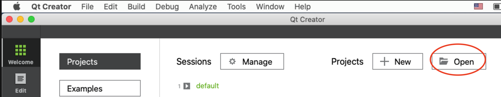
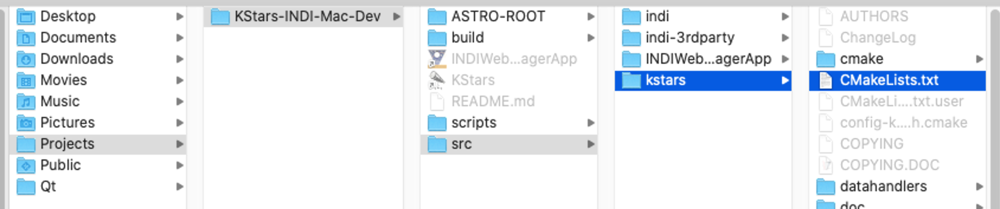

## Selecting the build folder in Qt Creator
MAKE SURE that you run the build script or the setup script before importing the build.  Select the "Choose" button
and navigate to the path of the forked build (or optionally the regular build) folder for your package. 
Your folder path will probably resemble one of the ones below.
- ~/Projects/Astro-Dev/build/craft-base/indi-build/indi-core-forked
- ~/Projects/Astro-Dev/build/craft-base/indi-build/ThirdParty-Drivers-forked
- ~/Projects/Astro-Dev/build/craft-base/indi-build/ThirdParty-Libraries-forked
- ~/Projects/Astro-Dev/build/craft-base/stellar-build-forked
- ~/Projects/Astro-Dev/build/craft-base/kstars-build-forked
- ~/Projects/Astro-Dev/build/craft-base/webmanager-build-forked

# Submitting changes to the software
For INDI, INDI Web Manager, KStars, and INDI 3rd Party, as long as you made your edits to the code in the forked repo folder, then you can just use the appropriate script to commit & push your changes and then go to GitHub and make a pull request.
- [INDICore.sh](scripts/submitChanges/INDICore.sh)
- [INDI3rdParty.sh](scripts/submitChanges/INDI3rdParty.sh)
- [StellarSolver.sh](scripts/StellarSolver.sh) 
- [KStars.sh](scripts/submitChanges/KStars.sh) 
- [INDIWebManagerApp.sh](scripts/submitChanges/INDIWebManagerApp.sh)
- [CraftBlueprints.sh](scripts/submitChanges/CraftBlueprints.sh) 

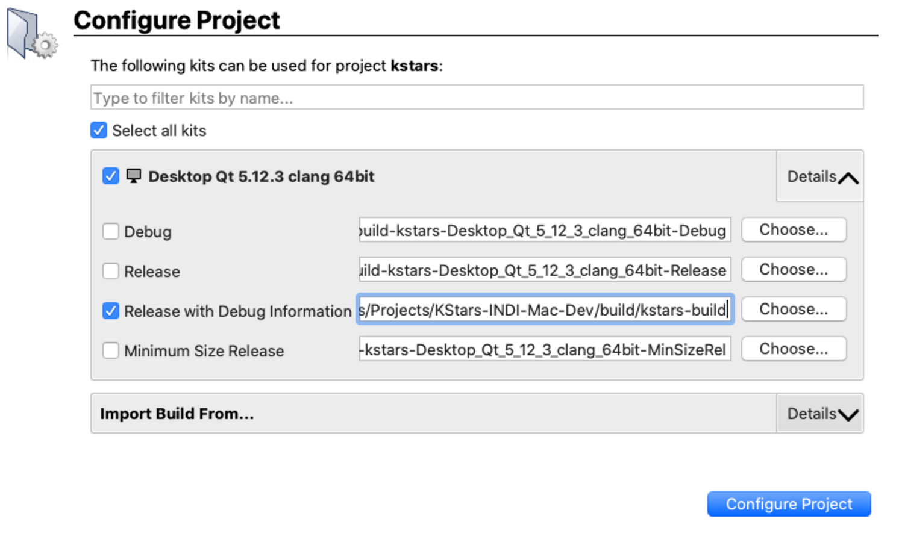

## Configuring QT Creator to build and run the program for Testing
For the build settings, you can really speed things up if you specify the target and the number of processors you have in the build options, but if you want to build all you can select that too.

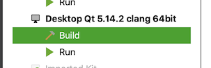
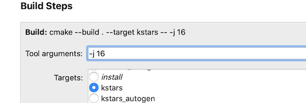

Under Projects, Build and Run, Run There is a new option in QT creator to "Add Build library search path to DYLD Library Path"  It seems to get checked by default 
which has been causing some conflicts between the libjpeg provided by MacOS and the one used by KStars and INDI.  Please uncheck this box to avoid the errors if you encounter any.

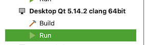
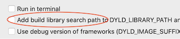

## Testing changes to INDI Core in QT Creator
Normally a person would select the executable they are working on and hit the "run" button in QT Creator to test changes to a program.  And while this works really well for testing your changes to
both KStars and INDI Web Manager, INDI works best when the indiserver starts the driver.  For testing INDI Core changes, you can select indiserver under the "run configuration" menu
and then type your driver in the command line arguments like this:
```
 -vvv ./indi_simulator_ccd ./indi_simulator_telescope ./indi_simulator_focus  
```
 Please see the Screenshot below:

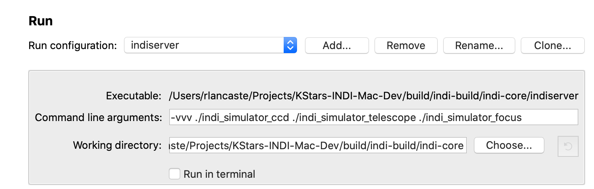

## Testing changes to INDI 3rd Party Drivers in QT Creator
Just like INDI Core drivers, 3rd Party drivers should be run from the indiserver.  Unfortunately, indiserver is part of the INDI Core repo, not the 3rd Party repo and usually the third party drivers build in subfolders.
But if you already built INDI Core before you built the 3rd Party drivers, then its not too difficult to use the "custom executable" function.  For example, here is the command line arguments that would be needed for DSI:
```
-vvv ../ThirdParty-Drivers /indi-dsi/indi_dsi_ccd
```  
In the screenshots below you can see how the custom executable can be selected and the command line arguments entered:


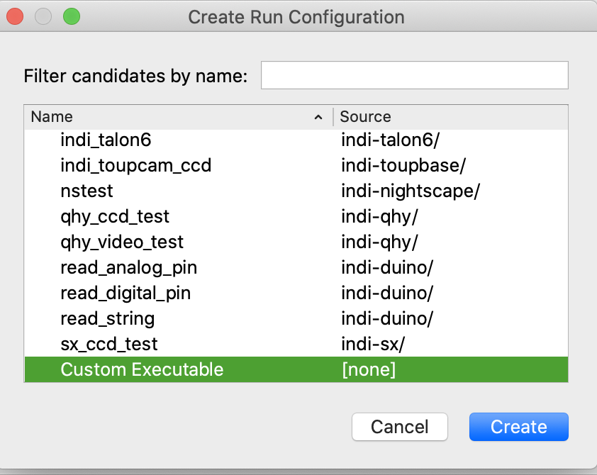
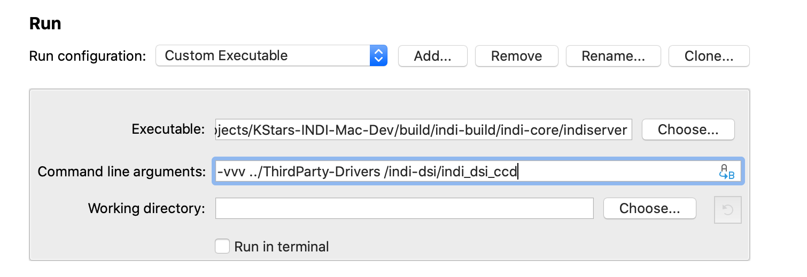

## Getting INDI Running in QT Creator to display simulated stars with GSC
The INDI Simulator CCD can optionally use the Hubble Guide Star Catalog and the GSC executable to generate very realistic simulated 
stars for testing purposes.  Please follow these steps to get it set up. Note that this is not needed for KStars because it already does this internally.
1. KStars for MacOS has the ability to download the GSC data in in the Startup Wizard.  Do this first.
2. Follow all the instructions above to get INDI Setup and ready to run in QT Creator.
3. The INDI Server will need the following environment variables to get GSC to work with it, edit them in the Run Configuration:
```
GSCDAT: $(HOME)/Library/Application Support/kstars/gsc
PATH: $(HOME)/ASTRO-ROOT/DEV-ROOT/bin:/usr/bin:/bin:/usr/sbin:/sbin
```
Please see the screenshot below:
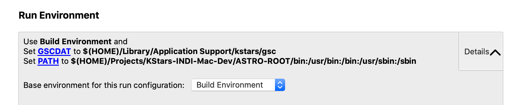

# Building with XCode instead of QT Creator
If you run this script with the BUILD_XCODE option, it will build using xcodebuild instead of make commands.  It also will create an XCode project so that you can
open it up and use XCode to edit the code.  If you would like to do this, you should have XCode already installed and setup.  You should also already have or you can create a code signing certificate.
If you just plan to build, test, change, and submit changes to the code and not distribute it to others, then you don't need to pay for the cerfificate.  A self signed certificate you create in KeyChain Access
will work just fine.  Once you have the certificate, all you need to do is to run these commands to get setup to work in XCode, replacing *YOUR ITENTITY* with your code signing certificate identity.

```
export CODE_SIGN_IDENTITY="YOUR IDENTITY"
~/Projects/Astro-Dev/scripts/setup.sh -x
```