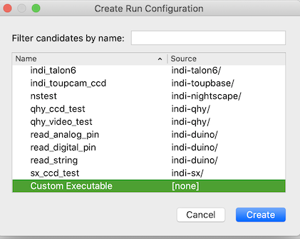

# KStars-INDI-Mac-Dev
A Script to easily build INDI, INDI Web Manager, and KStars for Mac using existing app folder(s) and the latest sources.  This will get you the latest bleeding edge versions and will facilitate development.


# About the repository
This repository was written by myself, Rob Lancaster, for the purpose of making it easier to get set up to easily build the latest versions of INDI, 3rd Party Drivers, KStars, and INDI Web Manager App on a Mac computer
as well as to be able to edit the source code to test out ideas or to diagnose problems.  This script is not meant for distribution of any of these items.  For building the latest versions and distributing them as a DMG,
please see my other repository [KStars-on-OSX-Craft](https://github.com/rlancaste/kstars-on-osx-craft).  This script, unlike those in the craft-based repository, does not attempt to build everything from scratch, but instead starts with already built APP bundles that 
have already been downloaded to your computer.  So it is very necessary that you download KStars.app first!  If you want to build or edit the INDI Web Manager App, you should download that one too, otherwise this script 
will skip that step.  So downloading KStars is required, but INDI Web Manager App is optional but recommended.  You will also need a version of QT, obtained from Homebrew, Craft, or installed using the official QT open source installer.
It is highly recommended that the version number of QT that you download should match the version that was originally used to build the app(s) you downloaded.  If the QT versions are different, there could be issues with functions 
not matching.

# Getting set up

1. Download and install [KStars.app](https://edu.kde.org/kstars/#download) (if not done already)
2. (Optional) Download and install [INDIWebManager.app](https://github.com/rlancaste/INDIWebManagerApp/releases) (if not done already)
3. Install each program, run it and set it up so that you can use it.  Your settings should all transfer to your new build when you make it.
4. Download and install [Qt](https://www.qt.io) from whatever source (Homebrew, Craft, QT Installer)
	Note: If you are using the QT Installer, when you run the install tool, select a version greater than 5.10 (5.12 preferably), install MacOS and QT Data Visualizations along with QT Creator.
	
5. Open the Mac Os Terminal and type the following commands, if it asks you to install Developer Tools, click ok.
```
mkdir ~/Projects
cd  ~/Projects
git clone https://github.com/rlancaste/KStars-INDI-Mac-Dev.git
```
6. Edit the script [build-env.sh](scripts/build-env.sh) to make sure all the variables are correct for your system, most important: the QT path.
7. Drag [setup.sh](scripts/setup.sh) to the OS X Terminal or just copy and paste the following into Terminal and run the script.
```
~/Projects/KStars-INDI-Mac-Dev/scripts/setup.sh
```
8. Now either use the programs, or get set up to edit the software.

# [build-env.sh](scripts/build-env.sh) options
There are a large number of variables that you can customize in build-env.sh.  They fall in several main categories.
1. Path Variables.  These options are listed first.  Most of them should not need to be changed, with the exception of the path to QT.  The rest are set automatically based on the path the script is installed to.  You can change them but don't need to do so.
2. REPO Path Variables.  These are the paths to the official repos.  You should not need to change them unless there is a problem.
3. FORKED REPO Path Variables.  If you plan to edit INDI, INDI 3rd Party, or INDI Web Manager, you need to uncomment whichever one you like, make sure the path gets set right to your fork, and then run the setup script again with the -r option.
4. Development Targets.  These are the minimum system for which executables will be built.  10.12 should be fine.
5. Script Build Options.  These determine which items the script should build.  You can comment out the ones you don't want to do right now.

# [setup.sh](scripts/setup.sh) options
The setup.sh script does not have a lot of options right now, but here they are:
- The -r option removes the dev-root directory and the previous builds and starts fresh.  It can even remove all homebrew packages and reinstall them if desired.
- The -h option shows information about how to use the script.
- The -o option allows you to build the software offline without checking Repos or connections.  Make sure it is all installed first
- The -x option will build with xcodebuild instead of make and will set up an XCode project

# Using the newly built programs

At this point you have a currently up to date version of INDI, INDI-3rd Party, KStars, and (optionally) INDI Web Manager App.
You can use these programs if you like, they should be fully functional and bleeding edge, 
but note that they are not portable, they rely on the files in the folders used to build these programs. This includes the QT version 
you linked it to, as well as the files in the ASTRO-ROOT directory.  So please don't delete these files, move the Dev folder to another location, or delete/replace QT.
If you do need to make a change like these, just re-run the setup script with the -r option and it will rebuild everything.  You CAN copy
the KStars.app or INDI Web Manager.app bundles to any other location on your computer and they should work just fine as long as the build folders don't get deleted.
If you want a truly portable app bundle, you will need to use the KStars-on-OSX-Craft repository to do that.

# Editing and Making Changes to the software

One of the primary goals of this repository is to make it easy to make changes to the code.  You can use either XCode or QT Creator for this
purpose.  It is recommended that you use QT Creator because it has the ability to edit the UI files and it is designed for QT development,
but XCode has some very nice features, especially its code analysis algorithms. 

## Forking the Repo and The source folder
For INDI, INDI 3rd Party, and INDI Web Manager, you should use the forked repo options in build-env.sh outlined below
to create a forked-src folder for whichever program you would like to edit the code for.  Of course, you COULD edit the one in the src folder if you like, but then when you
go to submit a pull request for your changes, you would need to fork the repo and put your changes in there anyway.  So my recommendation is that you leave the src folder alone
and make any changes that you want to make in the forked src folder for that program.  For KStars, the forked repo is not necessary because you will use arc and phabricator to submit changes,
so editing the code in the src folder is just fine.

## Editing [build-env.sh](scripts/build-env.sh) to fork whichever repo you would like to edit
To make this script automatically create a fork for you so you can make edits:
1. In [build-env.sh](scripts/build-env.sh), uncomment the forked repo line for the program you would like to edit
2. Enter your [gibhub.com](https://github.com/) username.  Get an account if you don't have one.
3. Run the [setup.sh](scripts/setup.sh) script again with the -r option.  

## Importing the source folder in QT Creator
In QT Creator, you can just go to "Open Project" and select the CMakeLists.txt in the folder of the project you want to edit.
You can use one of the paths shown below.
- ~/Projects/KStars-INDI-Mac-Dev/src-forked/indi/CMakeLists.txt
- ~/Projects/KStars-INDI-Mac-Dev/src-forked/indi-3rdparty/CMakeLists.txt
- ~/Projects/KStars-INDI-Mac-Dev/src/kstars/CMakeLists.txt
- ~/Projects/KStars-INDI-Mac-Dev/src-forked/INDIWebManagerApp/CMakeLists.txt


## Selecting the build folder in Qt Creator
MAKE SURE that you use the already built build folder for KStars or INDI Web Manager App.  DO NOT make a new build folder, because the app bundles require 
a lot of other files that are ALREADY IN the build folder.  The setup script has already set that all up for you.  Select the "Choose" button
and navigate to one of the following paths for the build folder as shown below.
- ~/Projects/KStars-INDI-Mac-Dev/build/indi-build/indi-core
- ~/Projects/KStars-INDI-Mac-Dev/build/indi-build/ThirdParty-Drivers
- ~/Projects/KStars-INDI-Mac-Dev/build/indi-build/ThirdParty-Libraries
- ~/Projects/KStars-INDI-Mac-Dev/build/kstars-build
- ~/Projects/KStars-INDI-Mac-Dev/build/webmanager-build


## Testing changes to INDI Core in QT Creator
Normally a person would select the executable they are working on and hit the "run" button in QT Creator to test changes to a program.  And while this works really well for testing your changes to
both KStars and INDI Web Manager, INDI works best when the indiserver starts the driver.  For testing INDI Core changes, you can select indiserver under the "run configuration" menu
and then type your driver in the command line arguments like this: -vvv ./indi_simulator_ccd ./indi_simulator_telescope ./indi_simulator_focus  Please see the Screenshot below


## Testing changes to INDI 3rd Party Drivers in QT Creator
Just like INDI Core drivers, 3rd Party drivers should be run from the indiserver.  Unfortunately, indiserver is part of the other repo, and usually the third party drivers build in subfolders.
But if you already built INDI Core before you built the 3rd Party drivers, then its not too difficult to use the "custom executable" function.  For example, here is the command line arguments that would be needed for DSI:
-vvv ../ThirdParty-Drivers /indi-dsi/indi_dsi_ccd  In the screenshots below you can see how the custom executable can be selected and the command line arguments entered.





## Getting INDI Running in QT Creator to display simulated stars with GSC
The INDI Simulator CCD can optionally use the Hubble Guide Star Catalog and the GSC executable to generate very realistic simulated 
stars for testing purposes.  Please follow these steps to get it set up.
1. KStars for Mac has the ability to download the GSC data in in the Startup Wizard.  Do this first.
2. Follow all the instructions above to get INDI Setup and ready to run in QT Creator.
3. The INDI Server will need the following environment variables to get GSC to work with it, edit them in the Run Configuration:
GSCDAT: $(HOME)/Library/Application Support/kstars/gsc
PATH: $(HOME)/Projects/KStars-INDI-Mac-Dev/ASTRO-ROOT/bin:/usr/bin:/bin:/usr/sbin:/sbin
Please see the screenshot below:


# Building with XCode instead of QT Creator
If you run this script with the -x option, it will build using xcodebuild instead of make commands.  It also will create an XCode project so that you can
open it up and use XCode to edit the code.  If you would like to do this, you should have XCode already installed and setup.  You should also already have or you can create a code signing certificate.
If you just plan to build, test, change, and submit changes to the code and not distribute it to others, then you don't need to pay for the cerfificate.  A self signed certificate you create in KeyChain Access
will work just fine.  Once you have the certificate, all you need to do is to run these commands to get setup to work in XCode, replacing *YOUR ITENTITY* with your code signing certificate identity.

```
export CODE_SIGN_IDENTITY="YOUR IDENTITY"
~/Projects/KStars-INDI-Mac-Dev/scripts/setup.sh -x
```

# Submitting changes to the software
- For INDI, INDI Web Manager, and INDI 3rd Party, as long as you made your edits to the code in the forked repo folder, then you can just use the appropriate script to commit your changes and then go to GitHub and make a pull request.
- [submitINDICoreChanges.sh](scripts/submitINDICoreChanges.sh)
- [submitINDIThirdPartyChanges.sh](scripts/submitINDIThirdPartyChanges.sh)
- [submitINDIWebManagerAppChanges.sh](scripts/submitINDIWebManagerAppChanges.sh)
- For KStars, if you made your changes in the KStars source folder, you can use the [submitKStarsChanges](scripts/submitKStarsChanges.sh) script to submit your changes with phabricator and arcanist.